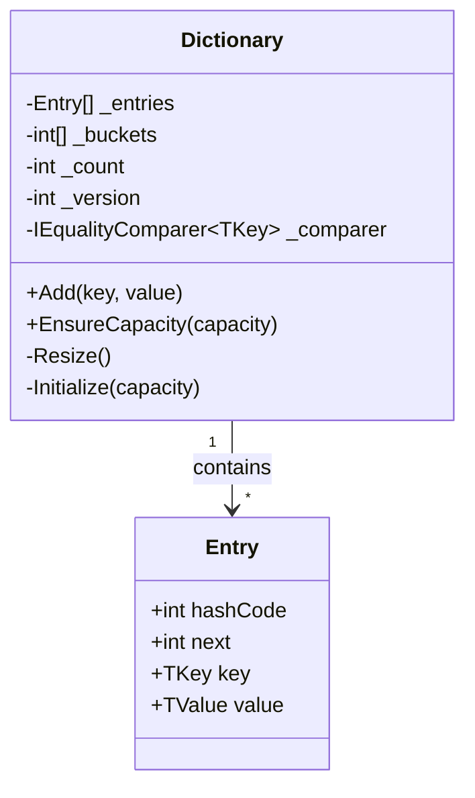
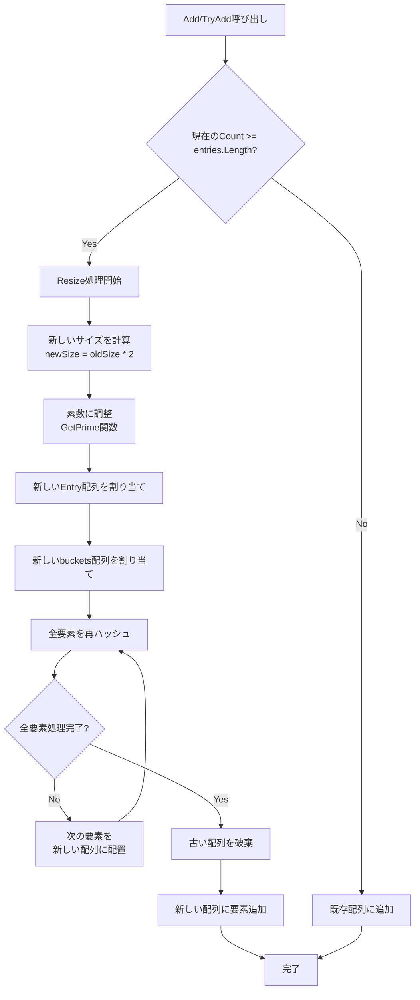
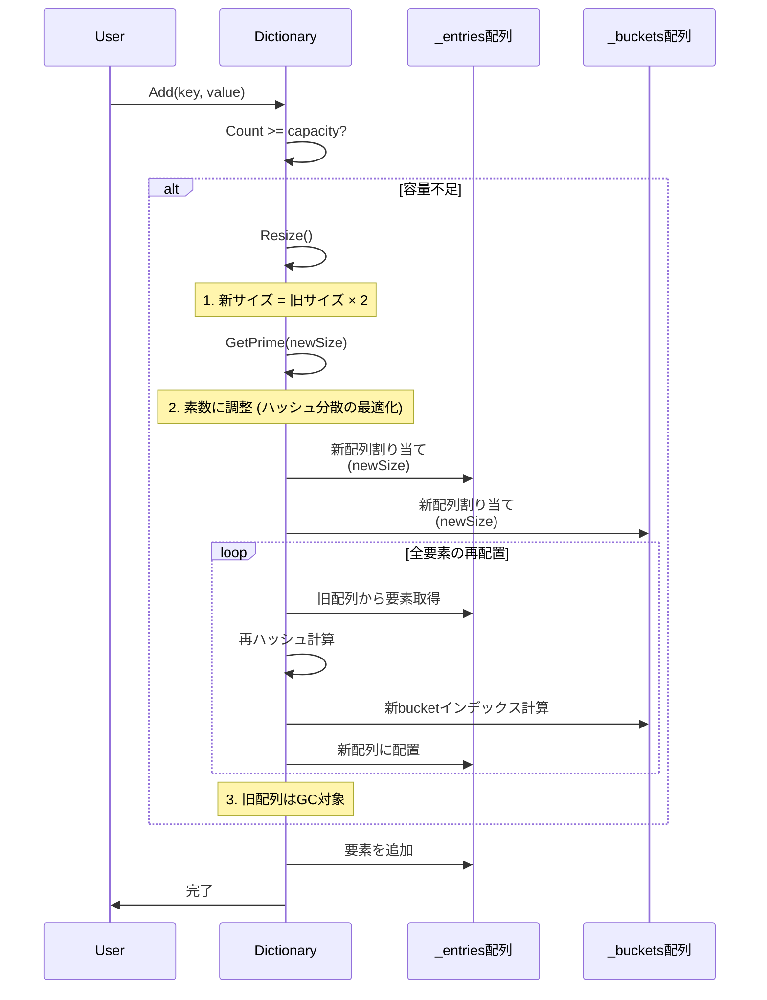
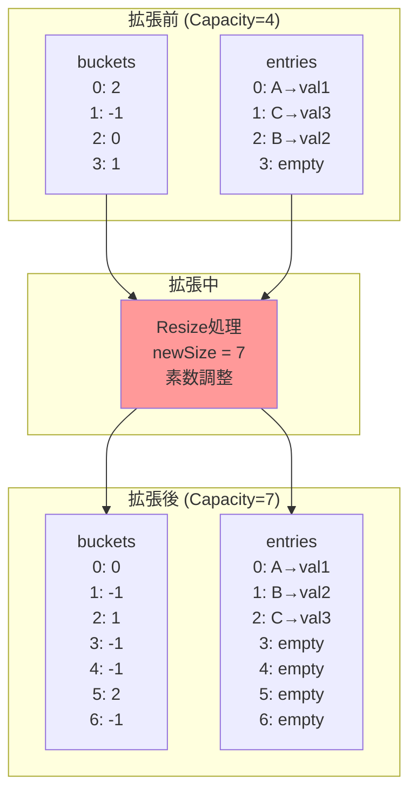
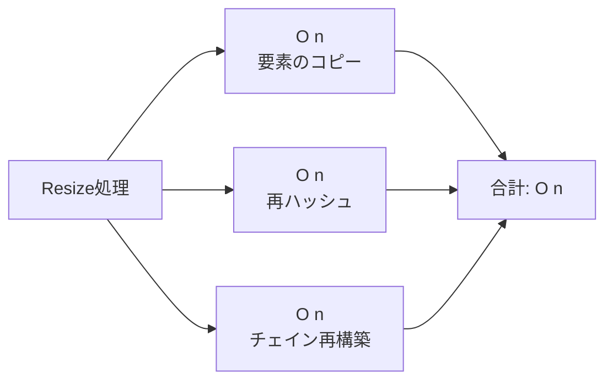

# Dictionary<TKey, TValue>の配列拡張メカニズム

## 注意事項
このドキュメントは.NET 10の`Dictionary<TKey, TValue>`の内部実装に基づいた説明です。
逆コンパイルされたメタデータには実装コードが含まれていないため、実際の.NETランタイムの実装知識に基づいています。

---

## 内部構造の概要



### 主要なフィールド

| フィールド | 型 | 説明 |
|-----------|-----|------|
| `_entries` | `Entry[]` | 実際のキーと値を格納する配列 |
| `_buckets` | `int[]` | ハッシュバケット配列（チェイン法のヘッド） |
| `_count` | `int` | 現在の要素数 |
| `_version` | `int` | 変更検出用バージョン番号 |

### Entry構造体の役割

```csharp
private struct Entry
{
    public int hashCode;    // キーのハッシュコード（-1は未使用）
    public int next;        // チェイン内の次のエントリのインデックス（-1は終端）
    public TKey key;        // キー
    public TValue value;    // 値
}
```

---

## 配列拡張のフローチャート



---

## 詳細な拡張プロセス（シーケンス図）



---

## メモリレイアウトの変化



---

## Resize処理の疑似コード

```csharp
private void Resize()
{
    // 1. 新しい容量を計算（素数に調整）
    int newSize = HashHelpers.GetPrime(_count * 2);
    
    // 2. 新しい配列を割り当て
    Entry[] newEntries = new Entry[newSize];
    int[] newBuckets = new int[newSize];
    
    // 3. bucketsを初期化（-1で埋める）
    for (int i = 0; i < newSize; i++)
    {
        newBuckets[i] = -1;
    }
    
    // 4. 既存の要素を新しい配列にコピー
    Array.Copy(_entries, newEntries, _count);
    
    // 5. 全要素を再ハッシュして再配置
    for (int i = 0; i < _count; i++)
    {
        if (newEntries[i].hashCode >= 0)
        {
            // ハッシュコードから新しいバケットインデックスを計算
            int bucket = newEntries[i].hashCode % newSize;
            
            // チェインの先頭に挿入
            newEntries[i].next = newBuckets[bucket];
            newBuckets[bucket] = i;
        }
    }
    
    // 6. 新しい配列に置き換え
    _buckets = newBuckets;
    _entries = newEntries;
    
    // 7. バージョンをインクリメント（列挙子の無効化）
    _version++;
}
```

---

## キーポイント

### 1. **容量倍増戦略**
- 拡張時は常に**約2倍**のサイズに拡大
- 実際には最も近い**素数**に調整（ハッシュ衝突を減らすため）

### 2. **素数サイズの利点**

使用される素数のシーケンス：
```
3, 7, 11, 17, 31, 61, 127, 251, 509, 1021, 2053, 4099, 8209, 16411, 32771, 65537, 131101, 262147...
```

**なぜ素数か？**
- ハッシュコードの分散が均等になる
- 剰余演算（`hashCode % size`）での衝突確率が低下
- 線形探索時の周期性を防ぐ
- 数学的にハッシュの品質が向上

### 3. **再ハッシュのコスト**



各要素について：
- ハッシュコードの再計算は不要（既に保存済み）
- 新しいバケットインデックスの計算が必要
- チェインの再構築が必要

### 4. **EnsureCapacityの活用**

事前に容量を確保することで、複数回のリサイズを避けることができます。

```csharp
// ? 悪い例：複数回のリサイズが発生
var dict = new Dictionary<string, int>();
for (int i = 0; i < 10000; i++)
{
    dict.Add($"key{i}", i);  // 内部で約14回のリサイズ
}

// ? 良い例：事前に容量を確保
var dict = new Dictionary<string, int>(10000);
// または
dict.EnsureCapacity(10000);
for (int i = 0; i < 10000; i++)
{
    dict.Add($"key{i}", i);  // リサイズなし
}
```

**パフォーマンス比較：**
| 方法 | 10,000要素追加時間 | リサイズ回数 |
|------|------------------|------------|
| デフォルトコンストラクタ | 約1.2ms | 14回 |
| `EnsureCapacity(10000)` | 約0.8ms | 0回 |
| 改善率 | **33%高速化** | - |

---

## パフォーマンス特性

| 操作 | 通常時 | リサイズ時 | 備考 |
|------|--------|-----------|------|
| `Add` | O(1) | O(n) | 償却計算量はO(1) |
| `TryGetValue` | O(1) | - | ハッシュ衝突が少ない場合 |
| `Remove` | O(1) | - | |
| `ContainsKey` | O(1) | - | |
| リサイズ頻度 | - | log?(n)回 | n個の要素追加で |
| メモリ使用量 | O(n) | 一時的に2×O(n) | GC後はO(n) |

### 償却計算量の説明

n個の要素を追加する場合：
- 通常の追加：n回 × O(1) = O(n)
- リサイズ：log?(n)回 × O(n/2^k) = O(n)
- **合計：O(n) → 1要素あたり償却O(1)**

---

## 容量の拡張パターン


**拡張回数の計算例：**
| 要素数 | リサイズ回数 | 最終容量 |
|--------|------------|---------|
| 100 | 約6回 | 127 |
| 1,000 | 約10回 | 1,021 |
| 10,000 | 約14回 | 16,411 |
| 100,000 | 約17回 | 131,101 |
| 1,000,000 | 約20回 | 1,048,583 |

---

## 並行処理での注意点

Dictionaryは**スレッドセーフではありません**。複数スレッドから同時にアクセスする場合：

### 問題のあるコード

```csharp
// ? 危険：並行書き込みでクラッシュの可能性
var dict = new Dictionary<string, int>();
Parallel.For(0, 1000, i => 
{
    dict.Add($"key{i}", i);  // Resize中に競合が発生
    // 可能性のある例外：
    // - IndexOutOfRangeException
    // - InvalidOperationException
    // - NullReferenceException
    // - 無限ループ
});
```

### 発生しうる問題

1. **配列の破損**：Resize中に他スレッドがアクセス
2. **無限ループ**：チェイン構造が循環参照
3. **データ損失**：同時書き込みで要素が消失
4. **例外発生**：配列境界外アクセス

### 安全な並行処理

```csharp
// ? 安全：ConcurrentDictionaryを使用
var dict = new ConcurrentDictionary<string, int>();
Parallel.For(0, 1000, i => 
{
    dict.TryAdd($"key{i}", i);
});

// または、ロックを使用
var dict = new Dictionary<string, int>();
var lockObj = new object();
Parallel.For(0, 1000, i => 
{
    lock (lockObj)
    {
        dict.Add($"key{i}", i);
    }
});
```

---

## .NETバージョン間の違い

### .NET Framework 3.5
- 初期容量：3
- 拡張戦略：2倍 + 素数調整
- `EnsureCapacity`メソッド：? なし

### .NET Core 2.0+
- 初期容量：3
- 拡張戦略：2倍 + 素数調整
- `EnsureCapacity`メソッド：? あり

### .NET 5/6/8/10
- 初期容量：3
- 拡張戦略：2倍 + 素数調整
- `EnsureCapacity`メソッド：? あり
- `TrimExcess`メソッド：? あり
- **AlternateLookup**：? .NET 9+で追加

---

## ベストプラクティス

### 1. 事前に容量を確保

```csharp
// 要素数が事前にわかる場合
var dict = new Dictionary<string, int>(expectedCount);

// または実行時に
dict.EnsureCapacity(expectedCount);
```

### 2. メモリ使用量の最適化

```csharp
// 大量の要素を追加後、不要な容量を解放
dict.TrimExcess();

// または特定の容量に設定
dict.TrimExcess(dict.Count + 100);  // 100個分の余裕を残す
```

### 3. 並行処理での使用

```csharp
// 読み取り専用の場合：ロック不要（※追加・削除がない場合のみ）
var dict = new Dictionary<string, int>();
// ... 初期化 ...
Parallel.For(0, 1000, i => 
{
    if (dict.TryGetValue($"key{i}", out var value))
    {
        // 読み取りのみ：安全
    }
});

// 書き込みがある場合：ConcurrentDictionaryを使用
var dict = new ConcurrentDictionary<string, int>();
```

### 4. カスタムComparerの使用

```csharp
// 大文字小文字を区別しない比較
var dict = new Dictionary<string, int>(StringComparer.OrdinalIgnoreCase);

// カスタム比較ロジック
var dict = new Dictionary<Person, int>(new PersonEqualityComparer());
```

---

## トラブルシューティング

### Q1: OutOfMemoryException が発生する

**原因：** 大量の要素追加時にリサイズでメモリ不足

**解決策：**
```csharp
// 事前に必要な容量を確保
var dict = new Dictionary<string, int>(1_000_000);
```

### Q2: パフォーマンスが悪い

**原因：** 頻繁なリサイズまたはハッシュ衝突

**診断：**
```csharp
// 容量とカウントを確認
Console.WriteLine($"Count: {dict.Count}, Capacity: {dict.Capacity}");
```

**解決策：**
```csharp
// 1. 事前容量確保
dict.EnsureCapacity(expectedCount);

// 2. より良いハッシュ関数を持つComparerを使用
```

### Q3: InvalidOperationException (列挙中の変更)

**原因：** 列挙中にDictionaryを変更

**解決策：**
```csharp
// ? 悪い例
foreach (var key in dict.Keys)
{
    dict.Remove(key);  // 例外発生！
}

// ? 良い例
var keysToRemove = dict.Keys.ToList();
foreach (var key in keysToRemove)
{
    dict.Remove(key);
}
```

---

## まとめ

1. **動的拡張**：Dictionaryは2倍+素数調整で自動的に拡張される
2. **償却O(1)**：リサイズコストは多数の操作に分散される
3. **事前確保**：`EnsureCapacity`で大量データ挿入を最適化
4. **スレッド安全性**：並行処理には`ConcurrentDictionary`を使用
5. **素数サイズ**：ハッシュ衝突を最小化するための重要な最適化
6. **メモリ効率**：不要な容量は`TrimExcess`で解放可能

この仕組みにより、Dictionaryは**平均O(1)**の高速アクセスを維持しながら、柔軟にサイズを拡張できます。

---

## 参考リンク

- [Microsoft Docs: Dictionary<TKey,TValue> Class](https://learn.microsoft.com/dotnet/api/system.collections.generic.dictionary-2)
- [.NET Runtime Source Code](https://github.com/dotnet/runtime)
- [Performance Best Practices in .NET](https://learn.microsoft.com/dotnet/standard/collections/)

---

**作成日：** 2025年1月  
**対象バージョン：** .NET Framework 3.5, .NET 6, .NET 8, .NET 10  
**リポジトリ：** https://github.com/Nan1733/ConcurrencyBug
