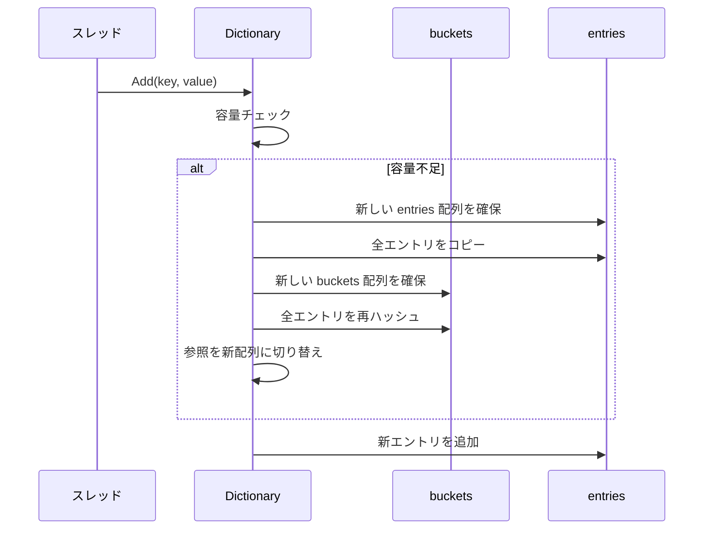
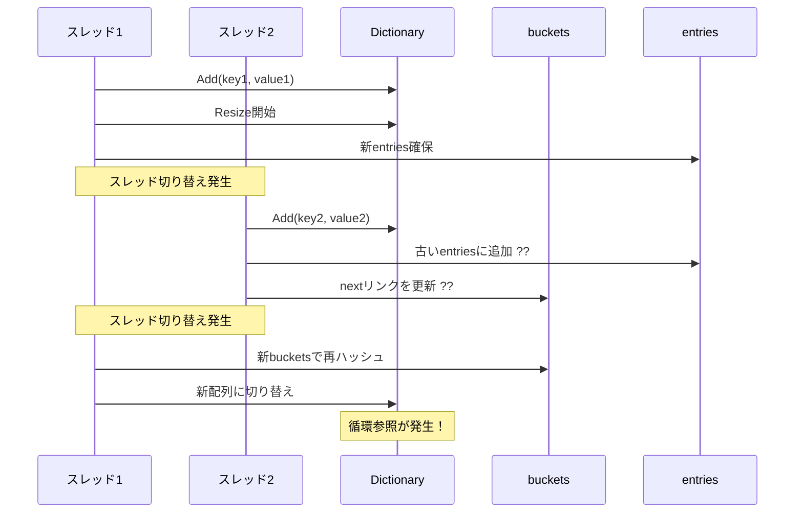
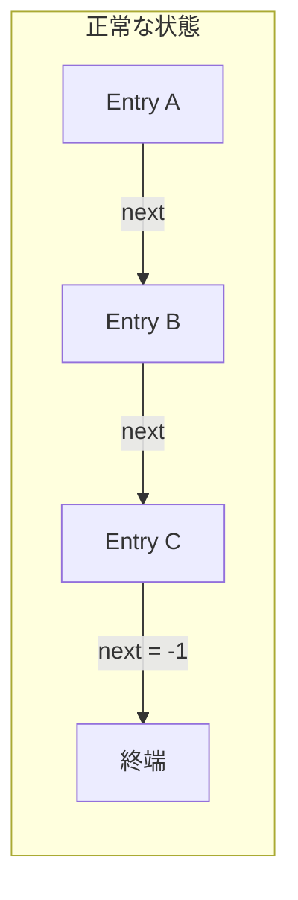
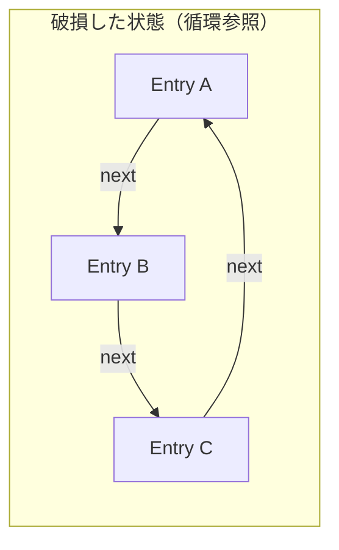
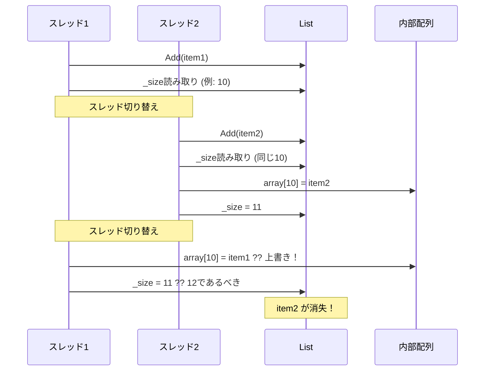

# 非スレッドセーフコレクションの並行アクセスによる破損

## 概要

.NET の `Dictionary<TKey, TValue>`、`List<T>`、`HashSet<T>` などの標準コレクションはスレッドセーフではありません。複数のスレッドから同時にこれらのコレクションを変更すると、内部状態が破損し、以下のような深刻な問題が発生する可能性があります：

- **CPU 使用率 100%**（無限ループに陥る）
- **データ消失**
- **予期しない例外**
- **デッドロック**

## Dictionary における無限ループの原理

### 内部構造

`Dictionary<TKey, TValue>` は **ハッシュテーブル** として実装されています。主要なコンポーネントは：

- **buckets**: ハッシュ値からエントリへの参照を保持する配列
- **entries**: 実際のキーと値を格納する配列
- **next**: 同じバケットに属するエントリをリンクリストとして連結するためのインデックス


### 正常な Resize 処理

コレクションの容量が不足すると、内部配列の **Resize（リサイズ）** が発生します：



### 並行アクセス時の破損

複数スレッドが同時に操作すると、Resize 処理の途中で他のスレッドが介入し、データ構造が破損します：



### 循環参照による無限ループ

`next` フィールドの更新が競合すると、リンクリストに **循環参照** が形成されます：





循環参照が発生すると、キーの検索時にリンクリストを無限に辿り続け、**CPU 使用率が 100% に張り付きます**。

## List における問題

`List<T>` では、内部配列の拡張時に以下の問題が発生します：



## HashSet / Queue における問題

これらも同様の内部構造を持つため、同様の問題が発生します：

| コレクション | 内部構造 | 主な問題 |
|-------------|---------|---------|
| `Dictionary<K,V>` | ハッシュテーブル + リンクリスト | 循環参照による無限ループ |
| `HashSet<T>` | ハッシュテーブル + リンクリスト | 循環参照による無限ループ |
| `List<T>` | 動的配列 | データ消失、IndexOutOfRangeException |
| `Queue<T>` | 循環配列 | データ消失、無限ループ |
| `Stack<T>` | 動的配列 | データ消失 |

## .NET バージョンごとの対応

### .NET 9 での検出機能追加

.NET 9 から、非スレッドセーフコレクションへの並行アクセスを**検出する機能**が追加されました。これにより、破損が発生する前に `InvalidOperationException` がスローされるようになりました。

**参照情報:**
- [Breaking change: .NET 9 - Non-concurrent collections don't throw on concurrent access](https://learn.microsoft.com/en-us/dotnet/core/compatibility/core-libraries/9.0/concurrency-check)
- [GitHub Issue #100337](https://github.com/dotnet/runtime/issues/100337)
- [GitHub PR #103419](https://github.com/dotnet/runtime/pull/103419)

### エラーメッセージ

.NET 9 以降では、並行アクセスが検出されると以下のようなメッセージが表示されます：

```
System.InvalidOperationException: Operations that change non-concurrent collections must have exclusive access. A concurrent update was performed on this collection and corrupted its state. The collection's state is no longer correct.
```

### バージョン別対応表

| .NET バージョン | 動作 |
|----------------|------|
| .NET Framework 全バージョン | 検出なし。破損や無限ループが発生 |
| .NET Core 1.0 - 3.1 | 検出なし。破損や無限ループが発生 |
| .NET 5 - 8 | 検出なし。破損や無限ループが発生 |
| .NET 9 以降 | **並行アクセスを検出し例外をスロー** |

## 解決方法

### 1. スレッドセーフなコレクションを使用する

```csharp
// Dictionary の代わりに ConcurrentDictionary を使用
using System.Collections.Concurrent;

var dict = new ConcurrentDictionary<int, string>();
```

| 非スレッドセーフ | スレッドセーフ代替 |
|-----------------|-------------------|
| `Dictionary<K,V>` | `ConcurrentDictionary<K,V>` |
| `Queue<T>` | `ConcurrentQueue<T>` |
| `Stack<T>` | `ConcurrentStack<T>` |
| `List<T>` | `ConcurrentBag<T>` または `lock` |
| `HashSet<T>` | `ConcurrentDictionary<T,byte>` または `lock` |

### 2. ロックを使用する

```csharp
private static readonly object lockObj = new object();
private static Dictionary<int, string> dict = new Dictionary<int, string>();

// 書き込み
lock (lockObj)
{
    dict[key] = value;
}

// 読み取り
lock (lockObj)
{
    return dict[key];
}
```

### 3. ReaderWriterLockSlim を使用する

読み取りが多い場合に有効です：

```csharp
private static ReaderWriterLockSlim rwLock = new ReaderWriterLockSlim();
private static Dictionary<int, string> dict = new Dictionary<int, string>();

// 書き込み
rwLock.EnterWriteLock();
try
{
    dict[key] = value;
}
finally
{
    rwLock.ExitWriteLock();
}

// 読み取り
rwLock.EnterReadLock();
try
{
    return dict[key];
}
finally
{
    rwLock.ExitReadLock();
}
```

## 参考資料

- [Microsoft Docs: Thread-Safe Collections](https://learn.microsoft.com/en-us/dotnet/standard/collections/thread-safe/)
- [Dictionary&lt;TKey,TValue&gt; Class - Thread Safety](https://learn.microsoft.com/en-us/dotnet/api/system.collections.generic.dictionary-2#thread-safety)
- [.NET 9 Breaking Change: Concurrency Check](https://learn.microsoft.com/en-us/dotnet/core/compatibility/core-libraries/9.0/concurrency-check)
- [GitHub: dotnet/runtime Issue #100337](https://github.com/dotnet/runtime/issues/100337)
- [GitHub: dotnet/runtime PR #103419](https://github.com/dotnet/runtime/pull/103419)
